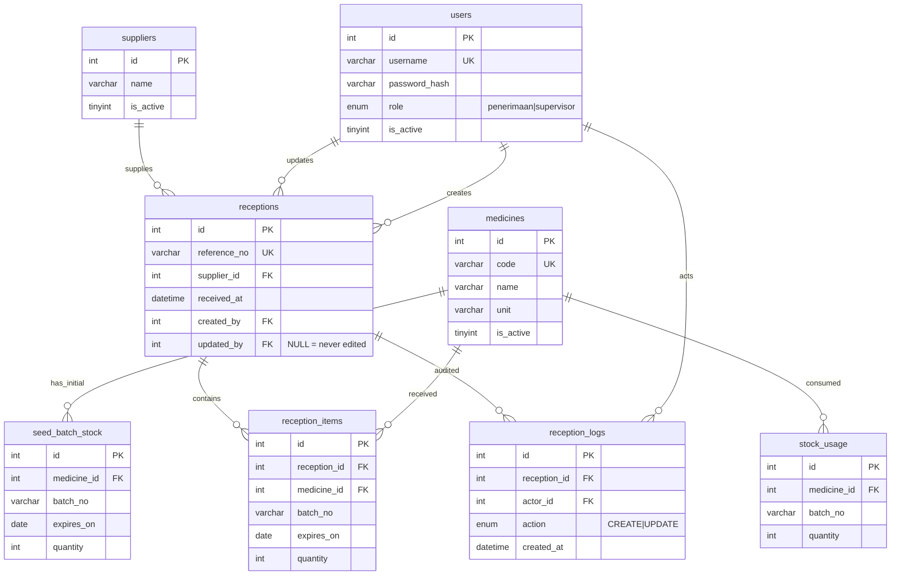

# Desain Database

## Diagram ERD



## Tabel

| Tabel | Peran |
| --- | --- |
| `users` | Akun petugas dan perannya. Dua akun demo dari seeder. |
| `suppliers` | Katalog pemasok beserta status aktifnya. |
| `medicines` | Katalog obat, satuan (`unit`), dan status aktifnya. |
| `seed_batch_stock` | Stok awal per batch pada 2026-10-01, sebelum pemakaian seed. |
| `stock_usage` | Pemakaian final oleh unit pelayanan yang mengurangi stok. |
| `receptions` | Header satu transaksi kedatangan dari satu pemasok. |
| `reception_items` | Rincian obat, batch, kedaluwarsa, dan jumlah per penerimaan. |
| `reception_logs` | Riwayat aksi buat/ubah per penerimaan. |

`suppliers`, `medicines`, `seed_batch_stock`, dan `stock_usage` berasal dari lampiran seed. Tiga tabel pertama dimuat ulang oleh `Lampiran/seed_farmasi.sql`; migrasi menyediakan skema provisional yang sama agar aplikasi bisa dijalankan dan diuji tanpa lampiran, dan direkonsiliasi saat lampiran tersedia.

## Kunci dan Indeks

- Primary key: `id` surrogate auto-increment untuk `users`, `receptions`, `reception_items`, `reception_logs`, dan tabel seed yang membutuhkannya. Surrogate dipilih agar join stabil dan tidak bergantung pada data bisnis yang bisa berubah.
- Foreign key: `receptions.supplier_id` ke `suppliers.id`, `receptions.created_by`/`updated_by` ke `users.id`, `reception_items.reception_id` ke `receptions.id` dengan `ON DELETE CASCADE` supaya menghapus penerimaan tidak meninggalkan item yatim, dan `reception_logs.actor_id` ke `users.id`.
- Unique: `users.username`, `medicines.code`, `receptions.reference_no`, `seed_batch_stock(medicine_id, batch_no)` mencegah stok awal batch ganda, dan `reception_items(reception_id, medicine_id, batch_no)` mencegah kombinasi obat-batch muncul dua kali dalam satu penerimaan.
- Indeks: `reception_items(medicine_id, batch_no)` untuk agregasi stok per batch, `receptions(supplier_id, received_at)` untuk daftar dan filter penerimaan, `reception_logs(reception_id, created_at)` untuk riwayat aksi.

## Model Stok

Stok dihitung sebagai agregasi ledger, bukan kolom stok yang dimutasi:

```
stok fisik batch = seed_batch_stock.quantity
                 + SUM(reception_items.quantity)
                 - SUM(stock_usage.quantity)
```

Kunci agregasi adalah pasangan `(medicine_id, batch_no)` sesuai identitas batch pada soal. Batch dikelompokkan menjadi tersedia bila `expires_on >= on_date` dan kedaluwarsa bila `expires_on < on_date`. Stok kedaluwarsa tetap dihitung sebagai stok fisik.

Alasan model ini: pembaruan penerimaan memakai keadaan akhir lengkap (`PUT` mengganti seluruh item), sehingga menghapus item cukup menghapus barisnya dan stok otomatis menyesuaikan tanpa rekonsiliasi manual. Pengiriman `PUT` identik dua kali tidak menggandakan stok karena tidak ada penambahan kumulatif di luar baris item. Batch nol tetap ditampilkan agar jejak batch tidak hilang dan urutan `expires_on` mendukung pemilihan FEFO manual.

## Konsistensi Transaksi

Setiap operasi buat/ubah penerimaan dijalankan dalam satu transaksi database:

1. Validasi payload dan hak akses dijalankan sebelum write. Kegagalan mengembalikan HTTP 4xx tanpa mengubah data.
2. Header penerimaan, seluruh item, dan log aksi ditulis dalam transaksi yang sama.
3. Jika satu baris item gagal, transaksi di-rollback sehingga penerimaan, stok, dan log tidak berubah sebagian.

Karena stok adalah hasil agregasi atas data tersimpan, rollback otomatis mengembalikan angka stok tanpa perhitungan kompensasi tambahan.

## Konvensi

- `receptions.created_by` tidak pernah berubah. `receptions.updated_by` bernilai `NULL` selama penerimaan belum pernah diubah, sehingga beda antara "belum diubah" dan "diubah oleh pembuat" tetap terlihat.
- Setiap aksi buat/ubah menambah satu baris `reception_logs` berisi `reception_id`, `actor_id`, `action`, dan `created_at`.
- Satuan mengikuti `medicines.unit` tanpa konversi.
