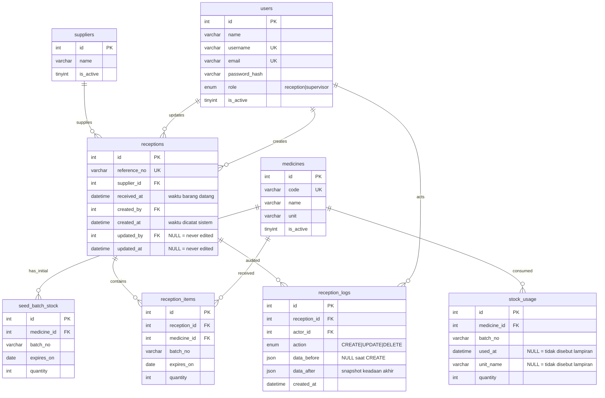

# Desain Database

## Diagram ERD



## Tabel

| Tabel | Peran |
| --- | --- |
| `users` | Akun petugas dan perannya. Dua akun demo dari seeder. |
| `suppliers` | Katalog pemasok beserta status aktifnya. |
| `medicines` | Katalog obat, satuan (`unit`), dan status aktifnya. |
| `seed_batch_stock` | Stok awal per batch pada 2026-10-01, sebelum pemakaian seed. |
| `stock_usage` | Pemakaian final oleh unit pelayanan yang mengurangi stok, beserta waktu pakai dan unit pelayanannya. |
| `receptions` | Header satu transaksi kedatangan dari satu pemasok. |
| `reception_items` | Rincian obat, batch, kedaluwarsa, dan jumlah per penerimaan. |
| `reception_logs` | Riwayat aksi buat/ubah per penerimaan beserta snapshot sebelum/sesudah. |

`suppliers`, `medicines`, `seed_batch_stock`, dan `stock_usage` berasal dari lampiran `app/Database/seed_farmasi.sql`. Isinya dipindahkan apa adanya ke `StockSeeder` (3 pemasok, 25 obat, 10 batch awal, 3 baris pemakaian) supaya angka laporan stok sama dengan contoh soal tanpa impor SQL manual. Seeder mencocokkan baris per `id`: `suppliers` dan `medicines` diperbarui di tempat karena dirujuk foreign key, sedangkan `seed_batch_stock` dan `stock_usage` dimuat ulang seluruhnya agar stok penerimaan lama tidak menumpuk. Kolom `used_at` dan `unit_name` hanya dibaca lampiran; perhitungan stok tetap memakai `quantity`.

## Kunci dan Indeks

- Primary key: `id` surrogate auto-increment untuk `users`, `receptions`, `reception_items`, `reception_logs`, dan tabel seed yang membutuhkannya. Surrogate dipilih agar join stabil dan tidak bergantung pada data bisnis yang bisa berubah.
- Foreign key: `receptions.supplier_id` ke `suppliers.id`, `receptions.created_by`/`updated_by` ke `users.id`, `reception_items.reception_id` ke `receptions.id` dengan `ON DELETE CASCADE` supaya menghapus penerimaan tidak meninggalkan item yatim, `reception_logs.actor_id` ke `users.id`, dan `reception_logs.reception_id` ke `receptions.id` dengan `ON DELETE RESTRICT`. Log sengaja **tidak** memakai `CASCADE`: `reception_items` adalah keadaan sekarang (ikut terhapus wajar), sedangkan `reception_logs` adalah jejak audit yang justru paling dibutuhkan ketika ada penerimaan bermasalah. Menghapus penerimaan lewat SQL manual akan ditolak selama lognya masih ada; endpoint `DELETE` sendiri tidak disediakan aplikasi.
- Unique: `users.username`, `users.email`, `medicines.code`, `receptions.reference_no`, `seed_batch_stock(medicine_id, batch_no)` mencegah stok awal batch ganda, dan `reception_items(reception_id, medicine_id, batch_no)` mencegah kombinasi obat-batch muncul dua kali dalam satu penerimaan.
- Indeks: `reception_items(medicine_id, batch_no)` untuk agregasi stok per batch, `receptions(supplier_id, received_at)` untuk daftar dan filter penerimaan, `reception_logs(reception_id, created_at)` untuk riwayat aksi.

## Model Stok

Stok dihitung sebagai agregasi ledger, bukan kolom stok yang dimutasi:

```
stok fisik batch = seed_batch_stock.quantity
                 + SUM(reception_items.quantity)
                 - SUM(stock_usage.quantity)
```

Kunci agregasi adalah pasangan `(medicine_id, batch_no)` sesuai identitas batch pada soal. Batch dikelompokkan menjadi tersedia bila `expires_on >= on_date` dan kedaluwarsa bila `expires_on < on_date`. Stok kedaluwarsa tetap dihitung sebagai stok fisik.

Alasan model ini: pembaruan penerimaan memakai keadaan akhir lengkap (`PUT` mengganti seluruh item), sehingga menghapus item cukup menghapus barisnya dan stok otomatis menyesuaikan tanpa rekonsiliasi manual. Pengiriman `PUT` identik dua kali tidak menggandakan stok karena tidak ada penambahan kumulatif di luar baris item. Batch nol tetap ditampilkan agar jejak batch tidak hilang dan urutan `expires_on` mendukung pemilihan FEFO manual.

## Konsistensi Transaksi

Setiap operasi buat/ubah penerimaan dijalankan dalam satu transaksi database:

1. Validasi payload dan hak akses dijalankan sebelum write. Kegagalan mengembalikan HTTP 4xx tanpa mengubah data.
2. Header penerimaan, seluruh item, dan log aksi ditulis dalam transaksi yang sama.
3. Jika satu baris item gagal, transaksi di-rollback sehingga penerimaan, stok, dan log tidak berubah sebagian.

Karena stok adalah hasil agregasi atas data tersimpan, rollback otomatis mengembalikan angka stok tanpa perhitungan kompensasi tambahan.

## Audit Trail

`reception_logs` menyimpan satu baris per aksi tulis pada penerimaan: `CREATE` atau `UPDATE` (enum juga menyediakan `DELETE`, tetapi endpoint hapus tidak ada di lingkup tes).

| Kolom | Isi |
| --- | --- |
| `reception_id` | Penerimaan yang diaudit. |
| `actor_id` | Petugas pelaku, diambil server dari sesi. |
| `action` | `CREATE` atau `UPDATE`. |
| `data_before` | Snapshot keadaan penerimaan **sebelum** perubahan. `NULL` untuk `CREATE`. |
| `data_after` | Snapshot keadaan penerimaan **sesudah** perubahan. |
| `created_at` | Waktu aksi. |

Kontrak snapshot (dibentuk `ReceptionService::snapshot()`):

```
{
  "reference_no": "PB-001",
  "supplier_id": 1,
  "received_at": "2026-10-03 10:00:00",
  "items": [
    {"medicine_id": 101, "batch_no": "PCT-2601", "expires_on": "2027-12-31", "quantity": 10}
  ]
}
```

- Item diurutkan `(medicine_id, batch_no)` supaya perbandingan before/after stabil meski urutan kiriman berbeda.
- Snapshot `before` pada `UPDATE` dibaca dari keadaan tersimpan (`itemsOf()`), bukan dari request, sehingga merekam kenyataan database.
- Request yang ditolak (403/422) tidak menulis baris log sama sekali.
- `PUT` identik tetap tercatat sebagai aksi baru dengan `data_before == data_after`, sehingga beda antara "ada aksi" dan "ada perubahan" tetap terlihat.

Alasan kolom before/after ada di sini, bukan di tabel terpisah: soal hanya mewajibkan `reception_id`, `actor_id`, `action`, dan waktu (isi sebelum/sesudah bersifat opsional). Kolom JSON `NULL`-able adalah tambahan termurah yang memenuhi kebutuhan audit tanpa mengubah bentuk tabel, dan `receptions` tetap satu-satunya entitas yang bisa ditulis aplikasi. `medicines`, `suppliers`, `seed_batch_stock`, dan `stock_usage` hanya dibaca dari lampiran, jadi tidak ada aksi tulis lain yang perlu diaudit. Bila nanti muncul domain tulis kedua, jalur generalisasinya adalah tabel `audit_logs(entity_type, entity_id, actor_id, action, data_before, data_after)` dengan backfill dari `reception_logs`; itu belum diambil sekarang karena `entity_id` generik tidak dapat di-FK dan justru melemahkan penjelasan foreign key yang diminta soal.

## Konvensi

- `receptions.created_by` tidak pernah berubah. `receptions.updated_by` bernilai `NULL` selama penerimaan belum pernah diubah, sehingga beda antara "belum diubah" dan "diubah oleh pembuat" tetap terlihat.
- `receptions.received_at` adalah waktu barang datang sesuai payload dan boleh di-backdate; `receptions.created_at` adalah waktu petugas mencatat di sistem. Keduanya berbeda makna dan tidak saling menggantikan.
- `receptions.updated_at` simetris dengan `updated_by`: keduanya `NULL` selama belum pernah diubah, sehingga pasangan `(updated_by, updated_at)` selalu null-null atau terisi bersama. Waktu diisi otomatis oleh model event (`beforeInsert`, `beforeInsertBatch`, `beforeUpdate`) memakai `Time::now()` yang mengikuti `appTimezone` Asia/Jakarta; identitas petugas tetap di-set service dari sesi.
- Database tidak memakai `DEFAULT CURRENT_TIMESTAMP` maupun trigger MySQL. `CURRENT_TIMESTAMP` mengikuti zona waktu server database, bukan Asia/Jakarta yang diwajibkan soal, dan default kolom tidak dapat menjaga `updated_at` tetap `NULL` sampai edit pertama. Sebagai jaring pengaman, insert tanpa `created_at` ditolak database (`ERROR 1364`).
- Model CI4 memakai `useTimestamps = false`. Bila diaktifkan, CI4 mengisi `updated_at` pada saat insert juga (`BaseModel::insert()`), sehingga merusak konvensi null di atas.
- `reception_items` tidak punya timestamp: item selalu diganti penuh saat pembaruan sehingga waktu per baris menyesatkan. Waktu perubahan tercatat di `receptions.updated_at` dan `reception_logs.created_at`.
- Setiap aksi buat/ubah menambah satu baris `reception_logs` berisi `reception_id`, `actor_id`, `action`, snapshot `data_before`/`data_after`, dan `created_at`.
- Satuan mengikuti `medicines.unit` tanpa konversi.
- `users.name` dipakai untuk menampilkan nama pembuat/pengubah pada detail penerimaan. `users.email` wajib dan unik, disiapkan untuk alur pemulihan kata sandi berbasis email (alurnya sendiri di luar cakupan tes).
